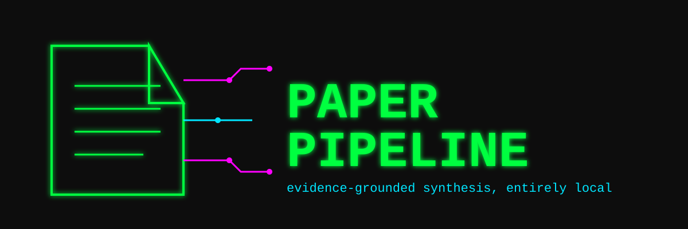
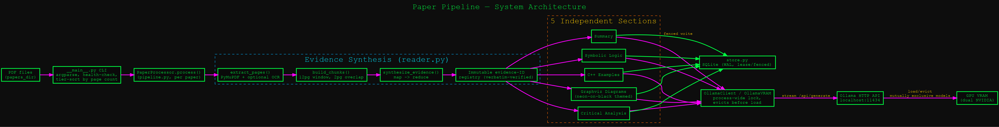
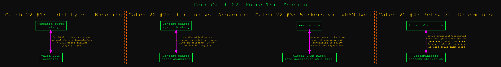
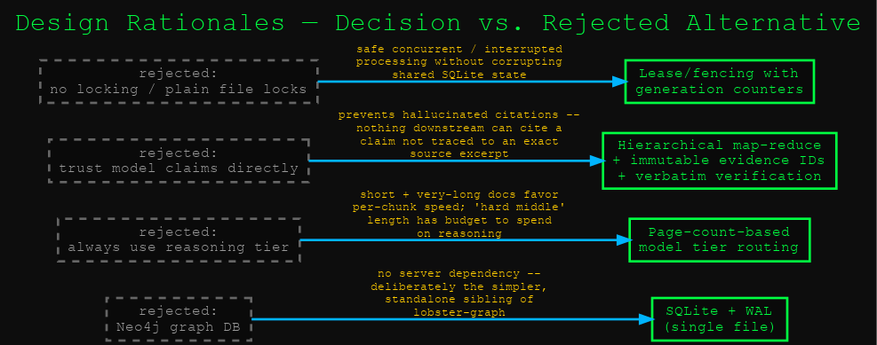
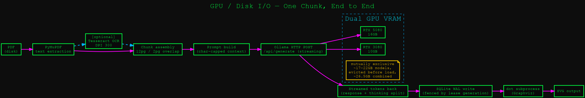
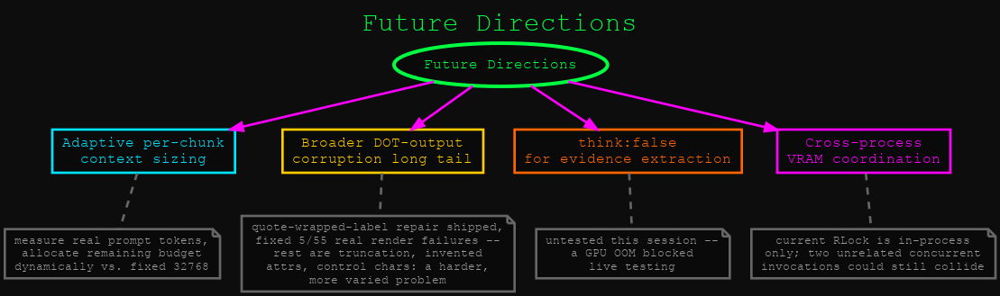
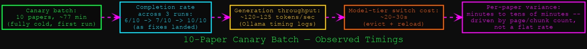

# Paper Pipeline

<p align="center">
  
</p>

<p align="center">
  <a href="https://github.com/danindiana/paper-pipeline/actions/workflows/pytest.yml"></a>
  <a href="https://python.org"></a>
  <a href="https://ubuntu.com"></a>
  <a href="https://nvidia.com"></a>
  <a href="https://ollama.com"></a>
  
  <a href="https://opensource.org/licenses/MIT"></a>
</p>

Evidence-grounded research paper synthesis using local LLMs via Ollama. PDFs go
in; a SQLite-backed dossier comes out — a structured summary, a symbolic-logic
formalization, C++ reference implementations, Graphviz diagrams, and a critical
analysis — with every non-trivial claim traceable to an exact, programmatically
verified excerpt from the source document. No cloud API calls, no server
dependency beyond a local Ollama instance. It's the simpler, standalone sibling
of [`lobster-graph`](https://github.com/danindiana/lobster-graph) (the same idea,
but backed by Neo4j instead of a single SQLite file).

---

> Built to answer a narrow question honestly: can a locally-hosted model
> summarize a paper *without making things up*? The answer here is a hierarchical
> map-reduce evidence pipeline that only lets downstream sections cite claims it
> can trace back to an exact quote on an exact page — and a lot of hard-won
> lessons, documented in [`diagrams/`](diagrams), about exactly how local models
> misbehave when you hold them to that standard.

---

## Technical Features

* **Evidence-grounded synthesis** — a hierarchical map-reduce pass extracts
  evidence items per chunk, each carrying an immutable evidence ID and a
  `support` excerpt that is *verified programmatically* as an exact substring of
  the source page — not trusted from the model's say-so. Reduction steps can
  only cite evidence IDs that exist in the registry; nothing downstream can cite
  a claim that wasn't traced to real source text.
* **Model auto-routing by page count** — short and very-long documents route to
  a fast tier; the "hard middle" length range routes to a stronger reasoning
  tier. See [`diagrams/03_rationales`](diagrams/03_rationales.svg) for why.
* **VRAM-aware Ollama client** — evicts mutually exclusive models before loading
  another (two ~20GB models don't both fit), and holds a process-wide lock
  across the full ensure-ready → generate cycle so `--workers N` never
  interleaves model transitions.
* **Empty-generation recovery** — a typed `EmptyGenerationError`, full terminal
  diagnostics (`done_reason`, `eval_count`, `thinking_len`, durations) on every
  failure, and one forced-reload retry before giving up on a chunk. See
  [`diagrams/02_catch22s`](diagrams/02_catch22s.svg) for the tension this
  doesn't fully resolve.
* **Robust JSON repair** — tolerates raw control characters and unescaped LaTeX
  backslashes that show up in verbatim-quoted excerpts from math-heavy PDFs,
  instead of silently returning the wrong nested JSON fragment.
* **SQLite lease/fencing** — owner ID + generation counter per paper, so
  concurrent or interrupted workers can't corrupt shared state. Content-hash
  keyed (`paper_hash`), so re-running a batch skips completed papers and only
  retries what's incomplete — no `--reprocess` flag needed for ordinary
  recovery.
* **Five independently retryable output sections** — summary, symbolic logic,
  C++ examples, Graphviz diagrams (neon-on-black themed), critical analysis —
  each re-runnable in isolation via `--reprocess`.
* **Optional Tesseract OCR fallback** for image-only pages, with OCR output
  cached by `(paper_hash, page, ocr_profile)` so a DPI/language change doesn't
  silently reuse stale text.

## System Diagrams & Architecture

### 1. System Architecture
The full pipeline: PDFs in, CLI orchestration, hierarchical evidence synthesis,
five independent LLM sections, all state persisted through a fenced SQLite layer.


### 2. Catch-22s
Four genuine circular tensions found while building this — not design flaws so
much as constraints that don't fully resolve, documented so the next person
debugging a similar symptom doesn't have to rediscover them from scratch.


### 3. Design Rationales
Why SQLite over a graph database, why page-count-based model routing, why
verbatim-verified evidence, why lease/fencing — each against the alternative
that was rejected and why.


### 4. GPU / Disk I/O
The literal data path from a PDF on disk to a rendered SVG diagram, including
where the dual-GPU VRAM constraint actually bites.


### 5. Future Directions
Four concrete follow-ups identified but not yet built, including one that
mirrors a fix already shipped for a different part of the pipeline.


### 6. Throughput
Real numbers from a 10-paper canary batch, not estimates.


The diagrams above deliberately reuse the exact neon-on-black Graphviz styling
(`bgcolor="#0d0d0d"`, neon green/magenta/cyan, Courier New) that
[`paper_pipeline/diagrams.py`](paper_pipeline/diagrams.py) injects into the
diagrams *this tool itself* generates for the papers it processes — the
project's documentation is drawn in its own house style.

## Getting Started

**Prerequisites:**
* Python ≥ 3.11
* [Ollama](https://ollama.com), running locally with your chosen models pulled
* `graphviz` (the `dot` binary) for diagram rendering
* Optional: `tesseract-ocr` + `tesseract-ocr-eng` for the OCR fallback path

```bash
pip install -e .

ollama pull gemma4:26b-a4b-it-q4_K_M   # fast tier
ollama pull qwen3.6:35b                # reasoning tier

python -m paper_pipeline /path/to/pdfs
```

The default SQLite path (`/mnt/nvme_staging/paper_processor_data/papers-v2.db`)
is this author's own machine — override it with `--db-path PATH` or the
`PAPER_PROCESSOR_DB` environment variable for your own setup.

**New to this?** [`cli_howto.md`](cli_howto.md) is the full cold-start
runbook — recovery, observability, troubleshooting, and the "why" behind the
guidance above. `./scripts/setup.sh` automates the install steps;
`./scripts/monitor.sh PAPERS_DIR --watch` gives you a live view (loaded
model, GPU, batch progress, a stuck heuristic) while a batch runs.

## CLI Flags

```
usage: paper_pipeline [papers_dir] [-h] [--model MODEL] [--code-model MODEL]
                       [--paper FILENAME] [--workers N] [--list]
                       [--reprocess SECTION] [--override] [--no-sort]
                       [--db-path PATH] [--ocr MODE] [--ocr-dpi DPI]
                       [--ocr-lang LANG] [--ocr-max-pages N]
```

| Flag | Default | Description |
|---|---|---|
| `papers_dir` | `~/Documents/AI-ML_Papers` | Directory containing PDF papers |
| `--model MODEL` | auto by page count | Force a specific model for all sections |
| `--code-model MODEL` | same as `--model` | Force a specific model for C++ sections only |
| `--paper FILENAME` | — | Process a single paper by filename |
| `--workers N` | `1` | Parallel workers — see the catch-22 diagram before raising this |
| `--list` | — | Show processing status and exit |
| `--reprocess SECTION` | — | Re-run one of `summary\|logic\|cpp\|diagrams\|extras\|all` |
| `--override` | — | Aggressively clear GPU VRAM before processing |
| `--no-sort` | — | Skip batch tier-sorting (process in filesystem order) |
| `--db-path PATH` | see above | SQLite database path |
| `--ocr MODE` | `auto` | OCR mode: `auto\|always\|never` |
| `--ocr-dpi DPI` | `300` | Tesseract rasterisation DPI |
| `--ocr-lang LANG` | `eng` | Tesseract language pack(s) |
| `--ocr-max-pages N` | `40` | Max pages to OCR per document (`0` = unlimited) |

Model auto-selection by page count: ≤35 pages and >200 pages route to the fast
tier; 36–200 pages route to the reasoning tier. See
[`diagrams/03_rationales`](diagrams/03_rationales.svg) for why.

## Testing

```bash
pip install pytest
python -m pytest tests/ -v
```

58 tests passing. Five real production bugs were found and fixed with a
regression test apiece:

* Empty-generation retry/recovery — `tests/test_empty_generation_retry.py`
* Reasoning-tier context-budget exhaustion — fixed via `CHUNK_SUMMARY_CTX`
  (see `diagrams/02_catch22s`)
* Control characters breaking verbatim-quote JSON parsing —
  `test_control_character_in_verbatim_support_does_not_break_parsing` in
  `tests/test_evidence.py`
* Unescaped LaTeX backslashes breaking the same JSON parsing —
  `test_unescaped_latex_backslash_in_support_does_not_break_parsing` in
  `tests/test_evidence.py`
* Invalid Graphviz attribute syntax (`Node ["label='...'"];` instead of
  `Node [label="...";]`) breaking diagram rendering —
  `tests/test_diagrams.py`. Confirmed against a real 308-paper overnight
  batch: fixes 5 of 55 diagrams that failed to render (the rest fail for
  more varied, less tractable reasons — see `diagrams/05_future_directions`).

## Hardware This Was Developed & Tested On

Dual NVIDIA GPUs (RTX 5080 16GB + RTX 3080 10GB, ~26.5GB combined VRAM),
Ollama v0.32.13, Ubuntu Linux. The model-eviction logic in `OllamaClient`/`OllamaVRAM`
exists specifically because two ~20GB local models don't both fit in that
combined VRAM budget.

## Future Directions

Four concrete follow-ups — adaptive per-chunk context sizing; the broader
DOT-output corruption long tail (a narrow quote-wrapped-label repair already
shipped, fixing 5 of 55 real render failures in one overnight batch — the rest
are more varied and harder: truncated generation, invented attributes, control
characters); `think:false` experimentation for evidence extraction (untested —
a GPU OOM blocked live testing); and cross-process VRAM coordination beyond the
current in-process lock. Details and rationale in
[`diagrams/05_future_directions`](diagrams/05_future_directions.svg).

## License

MIT — see [LICENSE](LICENSE).
